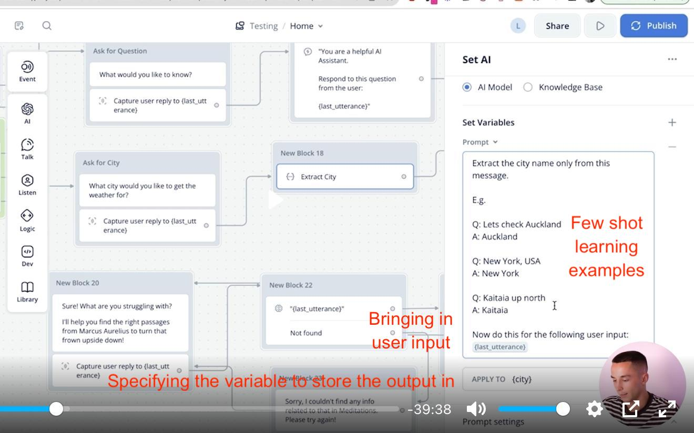
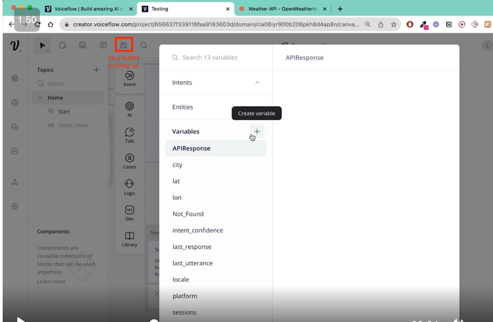
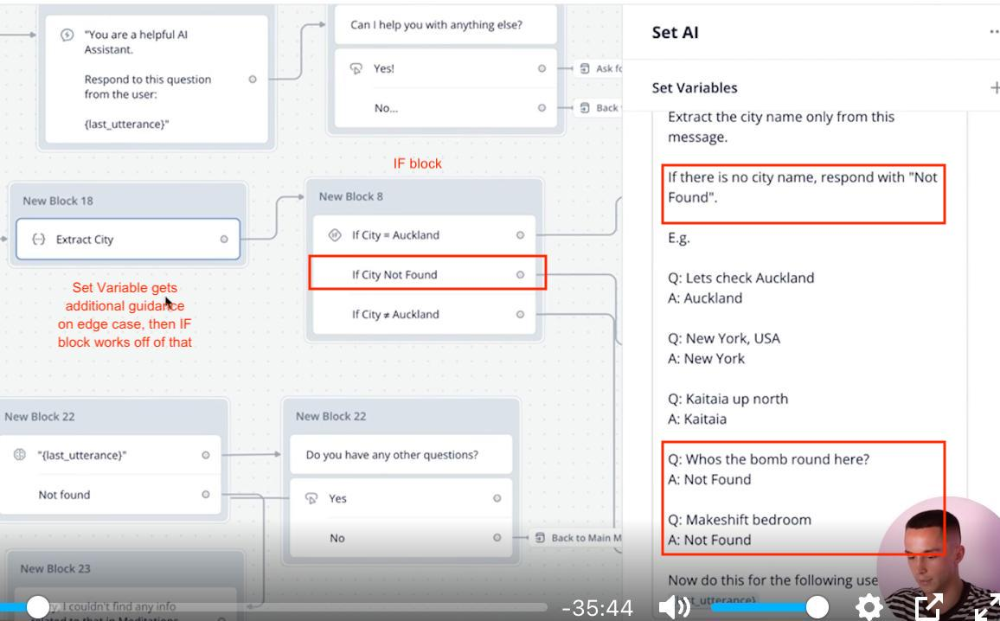
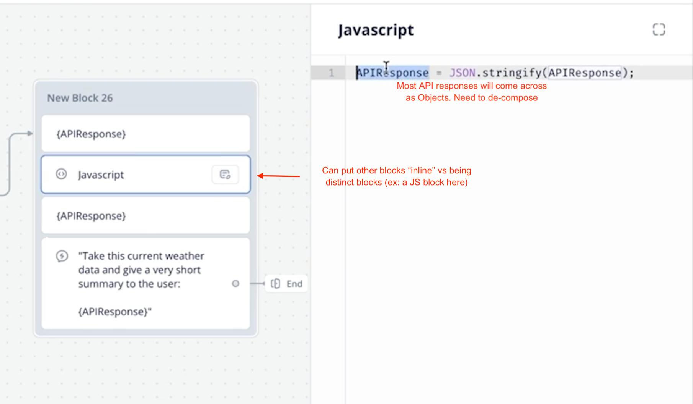
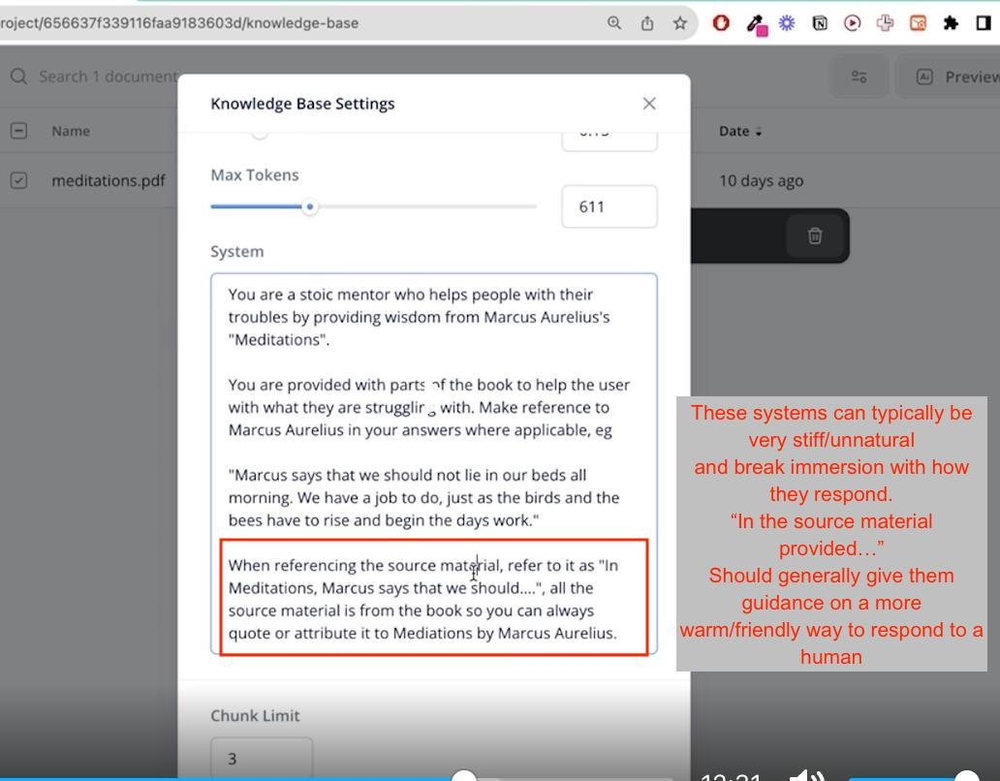
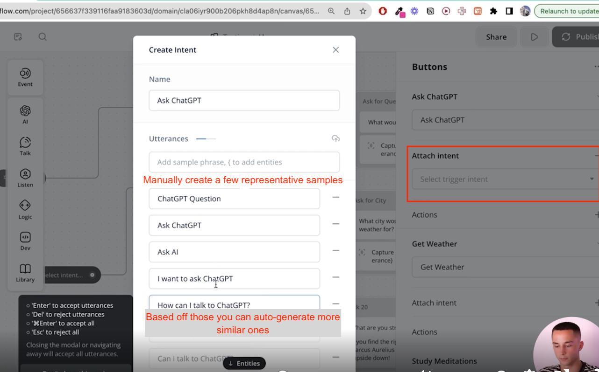
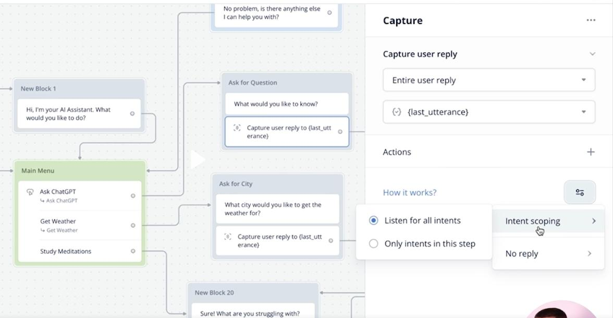
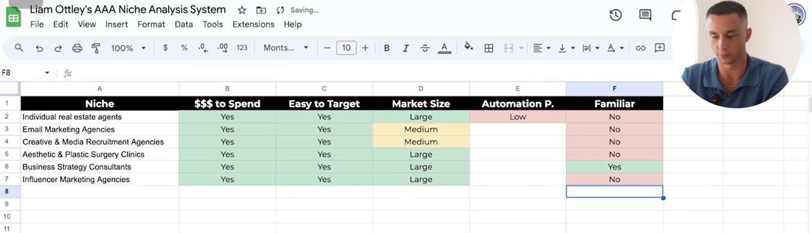
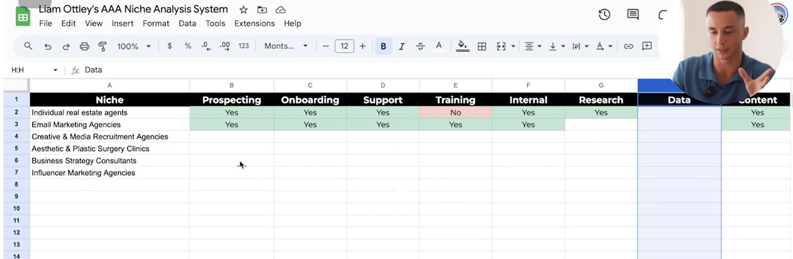
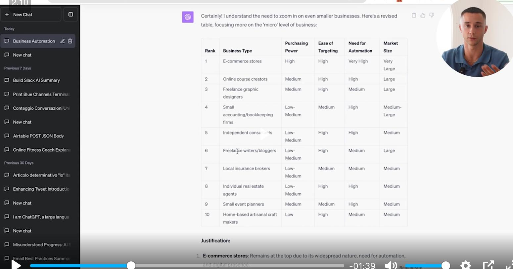

# "A-Z guide" playlist
- Liam Ottley (has profiles on most of the social networks)
- AI Automation Agency
- Certainly some bold claims (no need for coding experience, AI understanding, capital, etc.)
- Main goal of course to go from 0 -> signing 1st client
- "0 -> 10K case study" available on YouTube (https://www.youtube.com/playlist?list=PL2V6IBDeR5YPhjNSYSZam8UeNhMGZdXYN)
- Making the videos to increase his brand/visibility, goodwill.
- Semi-motivational content
  - Why are you doing this? What are current circumstances?
  - Take notes
  - Immerse yourself in this.
- Personal story
  - Early experience w/ entrepreneurial endeavors (protein reselling, watches, dropshipping). 
    - Holy shit, promised 24% semi-annual returns on family/friends round
    - Found for most of these ventures its a reversal of school process: do first, review, then learn off that. 
  - Moving around a bunch (New Zealand, Ireland, Dubai). 
  - Expanded skillset into some coding (now Dev/Marketing as MorningSide agency - "Learn to build and sell").
  - Building chatbots, but the dev costs around it was prohibitive, started looking into low/no code.

- `AI Automation Agency` - online business model focused on helping SMB to automate their processes w/ AI tech. Replacement or augmentation of existing personnel.
- Areas of focus:
  - Conversational - Chatbots
  - Research/Data analysis
  - Content generation
- Recommends picking a niche to start
- Start w/ low/no code. Can later expand to custom development.
- Try to keep it to a narrow set of deliverables.
- Possible pricing models:
  - 1-off builds
  - Build/maintain/improve for them
  - Teach them to make their own

## Jargon (Lesson 7)
- Like how straightforward this guy is. Good Vector DB discussion.
- `AI Persona` - An AI Clone of a person
- `AI qualifier/closer` - Have a conversation + collect info + qualify them for some sale/offer
- `Intent` - Intuiting what they are they trying to do, routing them appropriately
- `Agents` - Decompose a more complex task, potentially using many different external tools. Currently clunky. They stay away from it as it involves more custom dev. 
  
- Tech stack: Low code tooling/templates/generative AI

## Deliverable progression
3 Tiers of Deliverables (progression in terms of moat, complexity, value add, time to deliver):
1. Low code chatbot (VoiceFlow)
2. Low code automations (Zapier/Make addons to above)
3. Custom dev
Note: Can start simple to get foot in the door

Feels like I'm missing the boat if he's able to charge $1k for a 45 minute consult on AI applications.

## Recommended SW
- https://aaaaccelerator.notion.site/Softwares-cc5516cfcab243cf85715c781f97c8c0)
  - Lots of recommendations for Lead generation

## Other online biz models
- `SMMA` - Social Media Marketing Agency
- `AFBA` - Amazon (Fulfilled by Amazon)
- `DS` - Drop shipping

## Mindset (motivational style content) section
- Why? What is this for? What is the first checkpoint? What is your motivation?
- What kind of skillset do you need to get to that point?
- Like that "Its always my fault" framing
- Try to "touch the ground" and test what reality is vs making too many assumptions, then investing for a long time based off what may be an off-base concept.

## Entrepreneurship 101 section
- Habits are a lagging indicator of where you will be
- Prioritize your highest ROI activities
- [Suggested apps](https://hub.aaaaccelerator.com/c/module-1/sections/176106/lessons/654570)

## Method (Finding work/ creating biz) section
- [Business selection flowchart](https://www.figma.com/file/Y1F5WUvJkswc3s4IyZreHM/AAA-Business-101?type=whiteboard&node-id=0-1)
- Focusing ono a niche allows you to bite off a small enough chunk that given time you can become an expert in that area.

## No Code AI Automation 101 section
- These tools are intended for rapidly getting something out the door. Not necessarily the final step. Rapid prototyping. Show what can be done quickly.
- [3 hour chatbot building guide](https://www.youtube.com/watch?v=jCoH82LPgdk&t=4726s&pp=ygUUbGlhbSBvdHRsZXkgY2hhdGJvdHM=)
- [Liam's Voiceflow template](https://drive.google.com/file/d/1U81ky3DwDyObb_Hegx58bq5vMpyHYJ_V/view?usp=sharing)
- [Prompt engineering 4 beginners](https://www.youtube.com/watch?v=ydjRYmM19DY&t=29s&pp=ygUVbGlhbSBvdHRsZXkgcHJvbXB0aW5n)
- [Prompt engineering 4 advanced](https://www.youtube.com/watch?v=-XivIt_5oSw&t=909s&pp=ygUVbGlhbSBvdHRsZXkgcHJvbXB0aW5n)
- I like that Liam seems self-aware (Marcus Aurelius Meditations comment)
### Voiceflow basics
- [Video](https://hub.aaaaccelerator.com/c/module-1/sections/176109/lessons/654579)
- 15:00 - Debugging output. Useful.
- Colored branches - seems like a best practice for organizational purposes
- Block comparison: Set AI (no user output) vs Response AI (direct user output), otherwise very similar
  - 
- Variable creation
  - 
- "Preview" button - very useful
- LLM fallback conditionals
  - 
  - 21:00 IFs can also have a "No Match" path, should be used in case the LLM fails in its task of giving structure/expected output
- 22:00 Variable panel - useful
- JS Blocks
  - 
- Blocks can be stacked within blocks vs being distinct elements on the Canvas
  - 
  - Insertion of JS or Text blocks to print out current state can be very helpful in the debugging process (can be removed simply by deleting)
- 40:00 - Knowledge Bases
  - VoiceFlow Templates may not export the Knowledge Base! Potential issue
  - Offer the LLM settings directly on them. (Note: Some of these platforms include their own System Prompt prior to yours, limiting what can be done.) 
    - This can be overridden on a block by block basis on the Canvas if desired.
  - Can preview to sample what interactions will look like.
    - Additionally, shows what the Vector DB returned (raw inputs to the Model). Very useful for debugging/understanding the results you are getting.
  - The systems can be stiff/unnatural when responding. As such should always give them an instruction on how to respond more naturally:
    - 
  - A "Not Found" route can be defined, when the Knowledge Base does not find any elements sufficiently close to the query.
- "Intents" - 47:00 
  - Allow for taking a text input and navigating to different areas of the Flow
  - Can create a set of representative phrases for a given Block
  - Can scope other Blocks to allow/disallow using a given Intent
  - When the User enters free-form text the Flow will decide where they want to go
  - This seems like a feature that should be used very judiciously. Hard to debug, potentially confusing/unclear if too many are defined.
  - Best practice is probably to only use this for major functionality navigations (back to main menu or the starts of major workflow pieces)
  - 
  - 
  - Involves a pseudo-training step when using Intents (unclear what this actually is as its certainly not doing actual training in that time)
  - 51:00 - VFlow canvas jumps around with current context to make following things in Play mode more intuitive.
- [Open source alternative! Seems really good. Easily self-hostable. TODO: Investigate further](https://github.com/FlowiseAI/Flowise)

### Voiceflow Integrations
- Integrating w/ different services
  - Looking up API token
  - Checking available API endpoints + calling details
- Demonstrates using StackAI for its more expressive/unrestricted LLM implementation. Exposes API endpoint. Calls from VoiceFlow (Long running convo context available if a UUID is passed).
- AirTables shown too
  - Does it offer pure SQL? Or insist on its goofy syntax. He complains a bit about its filtering syntax

### Make.com Basics
- Much more aggressive pricing than Zapier
- WebHook driven
- [Templates used in lecture](https://drive.google.com/drive/folders/15BTwM-TsiBJ_HDlqeRF7PKyPknb0UNTc?usp=sharing)
- TODO: Should look into this more. Was unclear at times on what was specific to Make vs one of the integrated services.

## "Niche Selection" section
- Argues that more specific products can fit more and more exactly into a specific business case. More value added.
- Can tailor all your marketing to a specific type of person/biz
  - Too general "we do AI for biz" doesn't grab attention
- Niches allow for re-use of prior work. Faster subsequent creations. More profitable vs newer developments.
- Peace of mind in terms of development risk. (Much easier to reason about what can be delivered)
- Great marketing material builds up:
  - Allows for building up case studies
  - Referrals/Reviews
  - Much more powerful to be able to say "Yeah, we've done exactly that before" vs "We've done something similar and could adapt it to your case"
- Since you are getting a lot of re-use, you can afford to re-invest into improving the components you have.
- Pain now vs later framing
  - Easier to get clients if you are a generalist, now
  - Delivering/profits/maintainenance/etc. on acquired customers are all made more difficult 
  
- Start by brainstorming broad, what industries/use cases do you know about?
  - Breakdown those broader categories
    - Ex: Fitness/Health -> {Preganancy advice, nutrition, weight lifting, body building, etc.}
      - Can further refine down to lower levels until there's something of manageable scope, but w/ enough demand to make sense to develop against
- Classify opportunities based on:
  1. Purchasing power 
     - Resume services might attract a lot of interest, but if its mostly recently unemployed ppl who are cutting back on spending, not great.
  2. Ease of Targeting
     - Do they congregate somewhere where you can grab their attention? Or are they dispersed?
  3. Market size
  4. Automation potential
    - Propspecting (sales) chatbot
    - Training
    - Onboarding
    - Support
    - Dashboards (aggregate data into an easily digestable format)
    - Internal (looking up Standard Operating Procedures)
    - Data entry/cleaning/formatting
    - Research (ex: allow a Marketing firm to customize their pitch to a specific company w/ specific data)
    - Content Generation
  5. Your familiarity (or ability to learn about it)
- Process, start w/ overall eval, then examine Automation Potential
  - 
  - 
  - LOL. He tries directly farming it out to ChatGPT. Why not see what it gives I guess?
    - 

## "Market Research" section
- Try to get into the mind of potential customer:
  - How do they run their business?
  - What pain points do they have?
  - What keeps them up at night?
  - What is the worst part of their job?
 
Can get this insight either by:
| Approach      | Description | Pros | Cons | 
| :----:       |    :----:   |    :----:   |    :----:   |
| DIY Research | Use resources you can find to educate yourself (Reddit, online forums, statistics on industry), YouTube/TikTok ("day in the life of" or ppl selling stuff in these verticals), ChatGPT ("What is/does an X do?", "Outline a business plan for starting an X business"),    | Very fast to start. Low cost. | Not as accurate. |
| Partner w/ existing biz | Work pro bono to learn industry fundamentals by setting them up to fix their problems. Leverage contacts you already have (hard to use a cold connection). [Dripify templates (seems to be a messaging w/ delays type of outreach tool)](https://aaaaccelerator.notion.site/Dripify-Partner-Request-Templates-b210cb9b36f7412a8375904533d58738?pvs=4) | Better info, more likely to find product fix.  | Have to search for partner. May need to offer them some kind of right to sell or share of future sales to entice them. |
| Pay for consulting | Pay to schedule some time to get insight from existing player. Need to find someone, reach out, find out what their hourly rate is. Possibly utilize them later as they probably have connections that may be interested in these problems/solutions. | Speed/quality of info will be higher than partnering. | Cost. |

- ["AI Audit" - general set of questions to arrive at how an industry works/what their needs are](https://liamottley.notion.site/How-to-Perform-an-AI-Audit-7b2ae5e4af694ce59e5acbeea3fc54e2)
- Recommending FIGMA flow charting to layout problems/systems/biz processes

- Want to arrive at a state of having a # of Deliverables. Mix-match different "suites" of them. Then pitch them.

## "Business Setup" section
- Branding
  - Company name can be niche/target specific OR completely unrelated
    - Targeting makes it easier to convey who you are but may limit you as you find out more about what you want to pursue.
- Website
  - Keep it simple
  - Most people will only read the Headline, perhaps a bit more. Really important to have a concise/powerful message
  - Use research data to craft messages/copy that fit to niche
- Recommends Google Calendar + Calendly
  - Block out time that you don't want to meet w/ anyone (primary work block, sleep, etc.)
- Lots of Notion related services (CRM)
  - TODO: Need to look into these.
- Slack
  - TODO: Learn more about setup
- Personal Brand
  - IDK, I'm resistant to most of this, maybe I need to be less so
  - LinkedIn - Recommending AI Headshot (ehhh...)
  - Instagram - I guess this is what kids use now

## "Marketing Plan" section
- `Leads` - Someone you can contact w/ offers
  - Emails, LinkedIns, Instagrams, etc...
- `Qualified Leads` - Someone who has expressed interest in your offer (much harder)
- Generated Leads -> Try to convert them to Qualified Leads by interacting with them
- Types of Leads
  - `Inbound` - Attracting people to your business by giving something away (relevant, helpful content)
    - Takes longer to get going
    - Content
      - YouTube/TikTok/Instagram/FaceBook group postings/LinkedIn
    - Ads
      - YouTube/Google/etc.
  - `Outbound` - Email blasts/cold calls/etc.
    - Apollo.io
    - Google Maps (search for niche biz in your area)
    - LinkedIn Sale Navigator
    - Scrape FaceBook groups
    - Really interesting how much of this just sounds like Spam and violations of Service Terms (multi-domain email accounts to avoid filters, Dripify LinkedIn messaging campaign automation, etc.)

Lead Generation metrics:
  1. Targeting
    - Ideal Customer Profile (ICP) - What are you looking for?
      - Which Lead Gen method will be best for this ICP?

  2. Quality
    - Leads that are easy for you to get are also easy for others to get. Probably being spammed, less likely to respond.
    - Are there many other similar types of offers being put out? Is it saturated? Again, likely to fade into the background noise.

  3. Speed
    -  How quickly can you generate these Leads?
    -  Typically a quantity vs quality trade-off
  
Marketing Plan = Lead Generation + Outreach functionality (email, DM, cold calling, etc.)

## "Sales Process" Section
- Given responses from Marketing Plan (Outreach step), what do we do with them?
- Convert interest into sales/closes
- ICP awareness. Comes back to your research, which should inform what you emphasize in talking with them/asking questions about their specifics.
- What solution are you trying to sell?

### Call goals

1. Want to **qualify them** as quickly as possible, make sure that this person is someone you want to be talking to. Falls into your ICP.
2. Pinpoint their problem. 
    - How valuable is the problem to them?
    - Who are the decision makers needed to approve?
    - Budget?
    - Urgency?
    - Have you tried to solve this before?
3. Present your offer.
   - Will likely initially be a "Free Offer"
     - Must be positioned properly
       - "Free" can cut away at perceived value of what is being offered
       - May attract the wrong kind of client
     - Recommends performing normal sales operations, then at the final steps rather than trying to get them to pay -- go with free. Avoid any mentions of price ("I need to learn more about your business needs first", etc.) until the end. (TODO: Dave, dunno if this changes your thoughts about how to put out the initial pilot search)
       - Position as, in exchange for doing a good job, being compensated by:
         - Referrals
         - Reviews/Testimonials/Case Studies
         - Better understanding of the industry/lingo+jargon
         - Learning how to apply tools we know in practice
           - Learn Flaws/Strength of our approach/team
4. Address objections. 

### Sales Funnel in more detail:
1. First touch. How are you performing outreach? Need to generate a sufficient level of interest so that the next step is possible.
    - Recommends perfecting using one Outreach Channel first.
    - Very different "vibes"/systems/etc. on different platforms
    - Trying to just spam all, may not be ideal
2. Request to book a call
   - Harder than it seems. Most business owners are really busy, so 15-30 minutes can be tough. 
3. First call
    - Be aggressive in trying to QUALIFY them
      - Don't want to sit on a long call only to find out they're not a good fit.
    - Proceed w/ steps outlined above in "Call goals"
    - If there seems to be a fit, try to close here. Substantial drop-off if you do not. Should be feasible given its a "Free Offer"
4. Second call
    - If necessary.

## "Outreach" section
Cold calling issues + how to overcome:
1. No way to Contact (Lead Generation)
2. No Interest (hopefully via well-researched/crafted messages)
3. No Trust (build a relationship via listening/understanding)

- Numbers game, can increase the volume of messaging.
- Might expect .35% conversion rate through the cycle of: Open -> Reply -> Positive about solution -> Booking a call -> Closed
  - Works out to needing ~1K outreach messages to get 1 close
- Recommends an A/B approach amongst a couple of different offers/message chains to see what gets the most traction
- "Long = Gone"
  - As low effort, quick to read as possible on initial message
  - 2-3 lines, tops
  - AAA has templates that demonstrate typical message chains [template](https://voyviksolutions.notion.site/Templates-11ae44fe939d43368266ff38d39ccfa5)
  - Basic format:
    1. Greeting - "Hi {person}"
    2. Relevant Context (about person or industry) - "I saw you worked at X"
    3. Case study/Results - Spark interest/build credibility
    4. Call to Action

### Warming up/setting up email accounts
- Spam has made it so low trust domains largely get routed to the trash
- Lol. The description of Instantly. An industry I never knew about.
  - Essentially a botnet generating fake email traffic amongst different users of this service to ultimately get accepted by the big email deliverers
  - Can take up to 2 weeks
  - Need many accounts as there are limits to how much a single account can send w/o being flagged as a spammer.
- They use SquareSpace for purchasing domains
- Have 1 primary that does not send email
  - Have many variant domains. Just append common sense stuff like "try_easyBee.com", "get_easyBee.com", etc.
    - Can have 3 email accounts on each domain
    - Will try to avoid blacklisting via having a mix of 30 cold emails/ 20 warm emails per day
    - Pay monthly as the domains may get blacklisted
  - Each domain gets stood up w/ Google Workspace Starter
    - Provides GMail
      - IMAP for Instantly access on each email
        - Some kind of OAUTH style interaction
        - The more I see Instantly the more I love how blantant this is. "Read emulation"
  - SquareSpace automatically sets up MX and A records. Need to do SPF, DKIM, DMARC TXT records
    - Finally CNAME to get SSL verified
  - Can filter out Instantly traffic from your inbox to avoid notifications

### Instantly
- "Lead Finder"
  - Seems to be just scraping a lot of sites to generate a huge list of potential people to spam.
- Campaign tracking
  - Key metric is Postive Response rate. 
  - Opening/click through rate no longer reliable
- Increasing personalization of copy is possible w/ LLM instructions
  - Can incorporate things near the receipient, hyper target

## "Sales" section
- Sales is harder with cold/outbound Leads vs inbound/warm
- Build a relationship/bring value. Longer term relationships are more profitable and make selling easier.
- View sales from a problem solving perspective. Fully understand the problem. Ideally your solution should be the best one. If not, iterate, then re-pitch.
- 2 Call Close
    1. Discovery call
    2. Proposal call
    - "Time kills all sales" - Want to have this process move quickly

[General framework for calls, not bad](https://hub.aaaaccelerator.com/c/module-1/sections/176119/lessons/654626)

## "Onboarding" section
4 step process (good templates available [here](https://hub.aaaaccelerator.com/c/module-1/sections/176120/lessons/654629)):
1. Establishing a Contract ([docusign tutorial](https://www.loom.com/share/00e42f9c0d8b495e8ad575ecb307185e))
- Good to have to establish professional relationship, ensure confidentiality, lay out expectations --- even if working for free. 
2. Invoicing 
- Can be skipped given that this is a free offer
3. Establishing communication channels (Slack)
4. Gathering requirements

- TODO: "Free offer" of something that will get an unknown amount of usage (API calls/server cost). Would want something covering (or limiting) that.

### Case Studies
- Requires you to find/measure Key Metrics
- Then compare prior state to final state. Examples:
  - Customer support hours spent
  - Time spent on X before
- May be a rough estimate
- Ask for testimonials/reviews/etc. while you have some leverage (before final turnover of the system)
  - Video testimonial is more impactful than written.
  - Can be tough/touchy as you're doing for free, tasking client, etc.
    - Referrals obviously best, but toughest ask

### Product Turnover
1. Build/Maintain
- Continue to run on your own accounts w/ some kind of fee agreement/retainer
2. Build/Bounce
- Transfer over to their accounts at the end
3. Build on their accounts directly

- For #2 and #3, may need to teach/show them how to setup and use the accounts.
- On handover, good time to upsell them on:
  - Other desired functionality (this time for $$$)
  - Retainer/maintenance plan

### V1 Development
- Getting something in Client's hands ASAP is crucial
- Their attention/interest will wane as they have no skin in the game (it was free!)
- If you can deliver incrementally so they can see progress, good

### Revisions/Iteration
1. Capture feedback via a call where they can screenshare.
- The less hassle for them, the better
2. Address desired improvements
3. Minimize total iterations
- Only present big improvements

## "Next Steps" section
- After having succeeded with a Customer, next step is either:
  - Upsell w/ current Customer
  - "Reload" your current marketing materials based on the success to find more Customers
  - Referrals

---------------
# Things I know nothing about
- Running ads (facebook, google, etc.)
- Lead generation
- 
